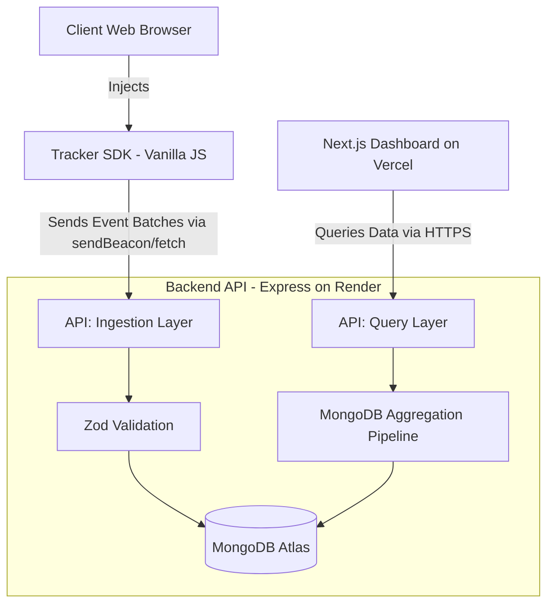
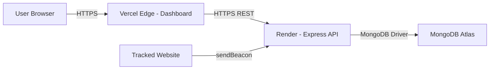

# High-Level Design (HLD)

The User Analytics Platform is designed for high availability, fast ingestion, and scalable data querying.

## Architecture Diagram

## Core Components

1. **Tracker SDK (`packages/tracker-sdk`)**:
   A lightweight, framework-agnostic JavaScript snippet (~3KB minified). It buffers events in memory and uses `navigator.sendBeacon` for robust delivery on page unload, with `fetch` fallback for batch flushes.

2. **Backend API (`apps/api`)**:
   A Node.js Express server acting as both the ingestion engine and the query engine. Validates all incoming events using shared Zod schemas. Serves paginated session data and heatmap coordinates to the dashboard.

3. **Database (MongoDB Atlas)**:
   Stores immutable events in a flat schema optimized with compound indexes (`{ sessionId: 1, timestamp: 1 }`). Aggregation pipelines compute session summaries, click coordinates, and dashboard statistics on-the-fly.

4. **Dashboard (`apps/dashboard`)**:
   Next.js app deployed on Vercel's edge network. Uses TanStack Query for data fetching with automatic caching, retries, and stale-while-revalidate. Shadcn UI + Tailwind CSS v4 for premium aesthetics.

## Deployment Architecture

## Design Choices & Trade-offs
- **MongoDB vs Time-Series DB**: MongoDB is excellent for rapid prototyping and moderate scale, but at hyper-scale (billions of events), a Time-Series Database like ClickHouse would be more appropriate.
- **Direct DB Ingestion vs Message Queue**: We ingest directly to MongoDB for simplicity. For higher throughput, an ingestion buffer like Kafka or BullMQ (Redis) should sit between the API and MongoDB.
- **Separate Deploy vs Monolithic**: Keeping API and Dashboard separate allows independent scaling — the API can be scaled horizontally on Render while the Dashboard leverages Vercel's global CDN.
