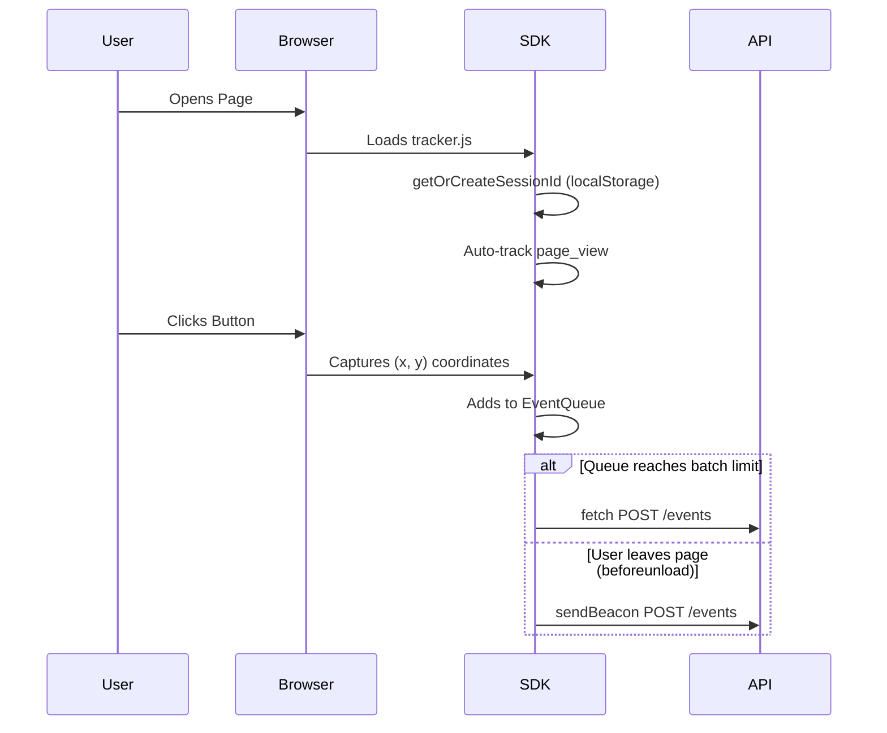

# Low-Level Design (LLD)

## 1. Database Schema (MongoDB)

**Collection**: `events`

| Field | Type | Description | Index |
|-------|------|-------------|-------|
| `sessionId` | String | Unique identifier for a user session (generated via crypto UUID) | Indexed (Compound) |
| `eventType` | String | Type of event (e.g., `page_view`, `click`) | Indexed |
| `pageUrl` | String | Full URL where the event occurred | Indexed |
| `timestamp` | Date | Exact time the event was tracked on the client | Indexed (Compound) |
| `metadata` | Mixed/Object | Contextual data (e.g., x/y coordinates, userAgent) | None |
| `createdAt` | Date | Time of DB ingestion | None |

*Compound Index*: `{ sessionId: 1, timestamp: 1 }` to quickly fetch ordered timelines for specific users.

## 2. API Endpoints

### Ingestion
`POST /api/v1/events`
- **Request Body**: `{ "events": [ AnalyticsEvent ] }`
- **Logic**: Validates via Zod `BatchEventsSchema`. Inserts directly to MongoDB using `insertMany`.

### Querying
`GET /api/v1/sessions`
- **Query Params**: `page`, `limit`
- **Logic**: Checks Redis Cache `sessions:page:{page}:limit:{limit}`. If miss, runs MongoDB aggregation pipeline to group by `sessionId`, calculate `eventCount`, `firstSeen`, and `lastSeen`. Sets Cache for 60s.

`GET /api/v1/heatmap?pageUrl=...`
- **Query Params**: `pageUrl`
- **Logic**: Checks Redis Cache `heatmap:{pageUrl}`. If miss, queries DB for `eventType: 'click'` and `pageUrl`. Returns an array of `{ x, y }`. Sets Cache for 120s.

## 3. Tracker SDK Workflow

